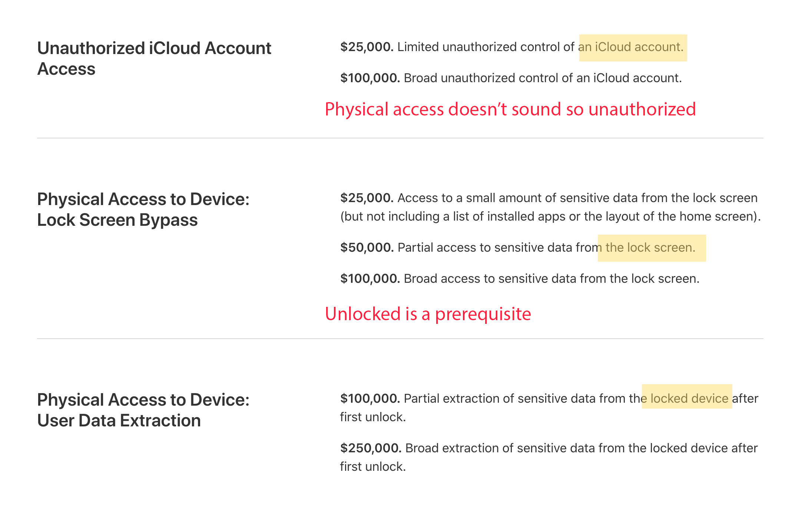

# iCloud token leak & database acquisition on iOS

**UPDATE on Aug 08, 2020**

This proof of concept has been reported to Apple around March upon their request, though I don't quite agree it's a vulnerability myself. It requires UNLOCKED and TRUSTED USB connection, then extracts an iCloud access token almost immediately. If you have experience of iCloud forensics, you'll know that this token roughly means account takeover when the account has no 2FA.

The limitation is so evident. It needs clear passcode to unlock the device and trust USB first. So it only makes sense to authorities to perform quick forensics. For example, an officer asks you to unlock the phone and connect it to some box. It could happen at a security check or even in the streets, and it only takes seconds to get access to your data. As far as I know, there are already plenty of jailbreak based solutions that give everything.

It seemed like Apple hardened the server-side very quickly, and you see some cloud forensics providers complaining about it: https://twitter.com/ElcomSoft/status/1245244361899749377. It's been months (individuals aren't supposed to have 90-day disclosure policy?), and I agree that the attack scenario is way too limited. I don't see this meet the bar of any one listed in their payout entries. So I make it public here.



It only gives HTTP 401 error now because of the hardened iCloud server.

---------

Key points:

* Abusing DDI to inject arbitrary envirnments string to apps (requires trusted USB & unlocked)
* Use `SQLITE_SQLLOG_DIR` to redirect all SQLite databases to controlled location
* Some of the apps are allowed to write to `/private/var/mobile/Media`
* Use AFC to (requires trusted USB & unlocked) fetch leaked database
* We can quickly extract AddressBooks, Safari browsing hsitory and cache with this trick. It doesn't require full backup so it's blazing fast. You know, forensic industry may have interest on such thing.

Bonus:

* iCloud REST API has a (an improper?) cache policy, making NSURLSession to leave sensitive tokens in the database
* `com.apple.Preferences` app can leak the iCloud Authorization header for us
* Luckily, this database can not be read before first unlock

I don't want to call it a bug since the only way to truly exploit it is to weaponize this with some other sandbox escape exploit. For example: medialibraryd arbitrary SQLite database access

* https://support.apple.com/en-il/HT210118
* https://www.slideshare.net/cisoplatform7/fasten-your-seatbelts-we-are-escaping-ios-11-sandbox

But somehow it can be abused to violate privacy. Imagine this, if an officer stops you and ask you to unlock and hand out your phone to perform a "quick" check with a USB connected blackbox, would you do so?

## DDI and instruments

I am too lazy to explain this part. In short, Developer Disk Image exposes some services via USB. It allows running arbitrary app (even those without get-task-allow) with controlled `argv` amd `envp`.

Sanitizing `envp` is enough. PLEASE DON'T REMOVE THIS! It seemed to be the only way to launch Safari for testing & Continuous Integration on jailed device. Developers need this.

> https://github.com/libimobiledevice/libimobiledevice/issues/793

## SQLITE_SQLLOG_DIR

Since Sierra & iOS 10, `SQLITE_ENABLE_SQLLOG` is on.

It's documented here:
https://www.sqlite.org/src/doc/trunk/src/test_sqllog.c

With this variable present, all of the databases will be duplicated. An index file who's name looks like `sqllog_0xxxx.idx` (where xxxx is zero-padded process id) will be created, then with all the databases redirected to the same directory.

This databases may include those are excluded from iTunes backup, e.g., NSURLSession cache.

Here is an example output of what we can obtain from MobileSafari:

```
./afcclient cat iTunes_Control/iTunes/safari/sqllog_02343.idx
0 /private/var/mobile/Containers/Data/Application/9210B36C-89E2-4728-9831-40CAA961C15E/Library/Image Cache/Favicons/Favicons.db
1 /var/mobile/Containers/Data/Application/9210B36C-89E2-4728-9831-40CAA961C15E/Library/Safari/BrowserState.db
2 /private/var/mobile/Containers/Data/Application/9210B36C-89E2-4728-9831-40CAA961C15E/Library/Image Cache/Touch Icons/TouchIconCacheSettings.db
3 /private/var/mobile/Containers/Data/Application/9210B36C-89E2-4728-9831-40CAA961C15E/Library/Image Cache/Password Icons/TouchIconCacheSettings.db
4 /var/mobile/Library/Safari/Bookmarks.db
5 /private/var/mobile/Containers/Data/Application/9210B36C-89E2-4728-9831-40CAA961C15E/Library/Safari/History.db
6 /var/mobile/Containers/Data/Application/9210B36C-89E2-4728-9831-40CAA961C15E/Library/WebKit/WebsiteData/LocalStorage/https_mobile.twitter.com_0.localstorage
7 /private/var/mobile/Containers/Data/Application/9210B36C-89E2-4728-9831-40CAA961C15E/Library/Safari/PerSitePreferences.db
8 /private/var/mobile/Containers/Data/Application/9210B36C-89E2-4728-9831-40CAA961C15E/Library/Caches/com.apple.mobilesafari/Cache.db
```

I have to emphasize again, the acquisition only takes seconds and it includes privacy that is usually excluded in iTunes backup.

Now it's important to choose where to write.

Some apps are not sandboxed. Some apps have exception like this:

```xml
<key>com.apple.security.exception.files.home-relative-path.read-write</key>
   <array>
    <string>/Library/com.apple.itunesstored/</string>
    <string>/Library/com.apple.iTunesCloud/</string>
    <string>/Library/Caches/com.apple.Music/</string>
    <string>/Library/Cookies/</string>
    <string>/Media/</string>
    <string>/Library/Caches/com.apple.Radio/</string>
    <string>/Library/Caches/com.apple.iTunesStore/</string>
    <string>/Library/Caches/sharedCaches/com.apple.Radio.RadioImageCache/</string>
    <string>/Library/Caches/sharedCaches/com.apple.Radio.RadioRequestURLCache/</string>
    <string>/Library/com.apple.MediaSocial/</string>
    <string>/Library/DeviceRegistry/</string>
    <string>/Library/Logs/MediaServices/</string>
   </array>
```

AFC allows r&w access to the Media folder. So let's redirect databases here.

Settings app is not sandboxed. Apart from the NSURLSesion cache, if you explore the Settings a bit you may see even more databases (ScreenTime, Health, etc.) recorded.

## iCloud takeover (can not bypass 2FA)

Opening Settings app (com.apple.Preferences) immediatly emits requests to iCloud REST api (https://setup.icloud.com/setup/get_account_settings). You'll find the request & response in the database. So what's the point to cache this request?

> 'Cache-Control': 'max-age=3600'

I see a lot 'Authorization' and tokens in the cache. And even these:

> 'X-Apple-I-MD': '***'

> 'X-Apple-I-MD-M': '***'

For those accounts that are not protected by 2FA, this token is the only thing you need to replay and gain (full, I think?) access to victim's iCloud. When 2FA has been enabled, the token looks longer but replay won't work anymore. We need to calculate a new `X-Apple-I-MD` for each new request. You can still grab X-Apple-I-MD-M in previous requests. I don't think I can challenge that algorithm so I am stopping here.

## PoC

prerequisite

* python
* `pip install requests`
* libimobiledevices
* Xcode and Instruments.app

(The Instruments part can be completely implemented on libimobiledevices, making it possible to run on raspberry pi or something)

1. Connect the phone, unlock and trust the computer.
2. `make demo` to compile and run
